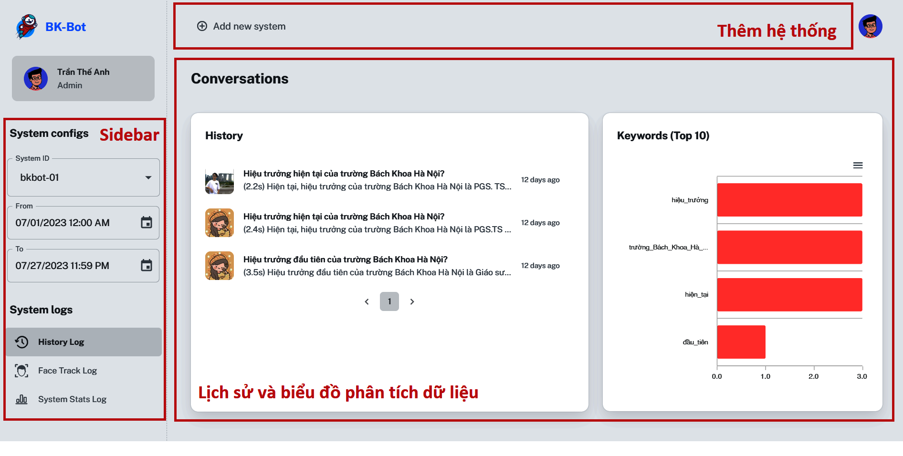

# BK-Consulting-Robot
Source code của hệ thống BKBot.

## 0. Giới thiệu chung

Thông tin của đồ án:

- **Tên đề tài:** *Ứng dụng tư vấn tuyển sinh ứng dụng trí tuệ nhân tạo trên hệ thống biên*
- **Người thực hiện:** **Trần Thế Anh** - *20183688* - *Trường Công nghệ thông tin và Truyền thông*
- **Mục tiêu:** Tăng trải nghiệm người dùng trong các giải pháp tư vấn tuyển sinh bằng cách ứng dụng AI và thiết bị biên
- **Phạm vi:** Tư vấn các chủ đề trong trường Công nghệ thông tin và Truyền thông

## 1. Kiến trúc tổng quan

Hệ thống gồm 3 thành phần chính:

- **Hệ thống biên:** Hệ thống các thiết bị phần cứng thực hiện tương tác trực tiếp với người dùng.
- **Khối quản trị:** Trung tâm của hệ thống, thực hiện trung chuyển, lưu trữ và phân tích dữ liệu.
- **Khối trả lời:** Phụ trách tạo ra câu trả lời cho các yêu cầu của người dùng. Do thành viên cùng nhóm nghiên cứu của tôi phát triển.

## 2. Cấu trúc của repository
Repository được chia thành 4 phần:

- **Arduino Uno** (*Hệ thống biên*): [README.md](arduino/README.md)
- **Jetson Nano** (*Hệ thống biên*): [README.md](jetson/README.md)
- **Server** (*Khối quản trị*): [README.md](server/README.md)
- **Client** (*Khối quản trị*): [README.md](client/README.md)

## 3. Hình ảnh thực tế

- Hệ thống biên

- Trang web quản trị
    - Trang đăng nhập
    
    - Trang đăng ký
    
    - Trang chủ
    

## 4. Triển khai thực tế

- Môi trường triển khai:
    - Địa điểm: Trung tâm Edtech, tầng 9, tòa B1, Đại học Bách Khoa Hà Nội
    - Thời gian: 10h30 - 12h, ngày 24/6/2023
    - Đối tượng: Khoảng 30 học sinh từ trường cấp 3 Tạ Quang Bửu

- Hình ảnh của buổi thử nghiệm:

- Kết quả đánh giá:
    - Chất lượng hệ thống
    
    - Chất lượng câu trả lời
    
    - Đề xuất cải thiện
    