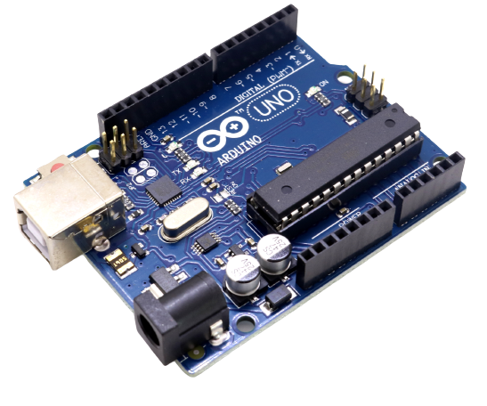

# BK Consulting Robot - Arduino
Source code cho **Arduino Uno** (*Hệ thống biên*) trong hệ thống BKBot.

## 1. Yêu cầu hệ thống

Thư viện:

- Arduino_JSON.h
- Servo.h

Thiết bị: **Arduino Uno R3**

## 2. Chạy chương trình

Nạp chương trình đã compile vào Arduino Uno. Chương trình sẽ được tự động chạy khi Arduino Uno được cấp nguồn.