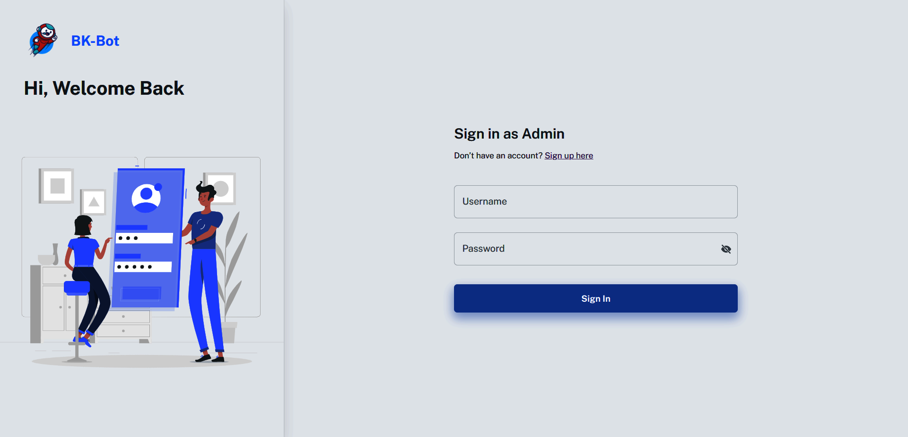
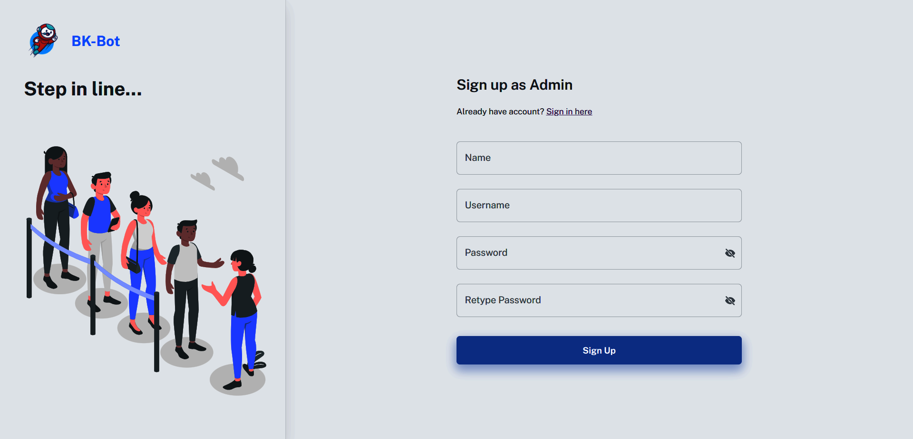
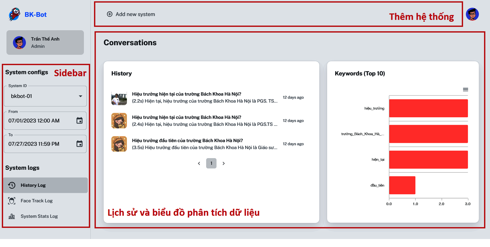

# BK Consulting Robot - Frontend
Source code cho **frontend server** (*Khối quản trị*) trong hệ thống BKBot.

## 1. Yêu cầu hệ thống
- Thiết lập môi trường
```
npm install
```

## 2. Chạy chương trình
- Build chương trình
```
npm run build
```
- Chạy chương trình đã build
```
serve -s build
```

## 3. Hình ảnh thực tế

Giao diện trang web:
- Trang đăng nhập

- Trang đăng ký

- Trang chủ


Truy cập và trải nghiệm trực tiếp tại địa chỉ [34.142.132.0:3000](34.142.132.0:3000). Tài khoản thử nghiệm:

- Username: `theanh`
- Password: `Abc123mnpq!`