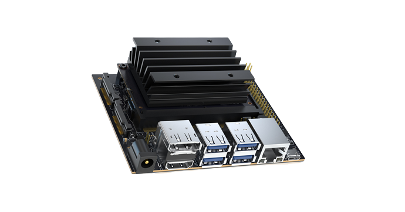

# BK Consulting Robot - Jetson
Source code cho Jetson Nano trong hệ thống BKBot.

## 1. Yêu cầu hệ thống
Thư viện
- OpenCV
- TensorRT
- Pytorch
- SpeechRecognition
- gTTS

Mô hình phát hiện khuôn mặt: [Yunet.trt](https://drive.google.com/file/d/1iKt2XgVe_YNRp9L89ZyCE8gm3eTJ-k2l/view?usp=sharing)

Thiết bị: Jetson Nano



## 2. Chạy hệ thống
Các file để cấu hình hệ thống được đặt trong folder `configs`. Cụ thể:

- `facetrack.yml`: Cấu hình camera truy vết
- `speechprocess.yml`: Cấu hình hỏi đáp
- `log.yml`: Cấu hình log

Sau khi hoàn thành cấu hình, chạy chương trình theo một trong 2 cách sau:
- Chạy thông thường
```
bash scripts/run.sh
```
- Chạy tự động
```
bash scripts/autorun.sh
```